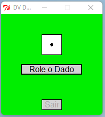
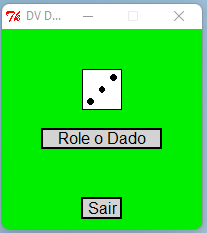

# python-dice
 Dice made in Python with executable file and graphical interface
 
### How does it work:
* Click on roller.exe file and the program will start.
* To play, just click on the **Role o Dado** button, every time you click on this button the program will show a random number from 1 to 6.
* To exit just click on the <exit> button or on the icon with the **X** drawing in the program window.
 
 Note: There is an icon file called DV Dado that can be added as application icon in a shortcut

Executable dice made in Python language with graphical interface

---

Powered by DViga ❤️

## Screenshots of usage examples:

 
